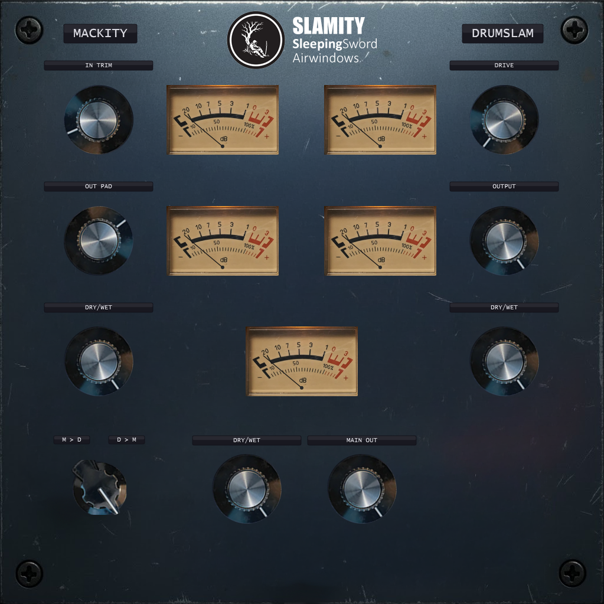

# Slamity

**Combined Airwindows Mackity + DrumSlam plugin with VU meters.**

DSP derived from [Airwindows](https://www.airwindows.com/) by Chris Johnson (MIT License).



## Download

**[Download Slamity v1.0.0 VST3 (Windows x64)](https://github.com/sleepingsw0rd/Slamity/releases/tag/v1.0.0)**

## Features

- **Mackity** — Airwindows channel strip saturation with In Trim, Out Pad, and Dry/Wet
- **DrumSlam** — 3-band drum saturation with Drive, Output, and Dry/Wet
- **Chain Order** — switch between Mackity > DrumSlam or DrumSlam > Mackity
- **Main Output** — global output gain and dry/wet mix
- **5 VU Meters** — real-time level monitoring at each stage
- **VST3 + Standalone** formats

## Controls

| Section | Control | Description |
|---|---|---|
| Mackity | In Trim | Input gain before saturation |
| Mackity | Out Pad | Output level after saturation |
| Mackity | Dry/Wet | Blend between dry and saturated signal |
| DrumSlam | Drive | Saturation intensity |
| DrumSlam | Output | Output level after saturation |
| DrumSlam | Dry/Wet | Blend between dry and saturated signal |
| Global | M > D / D > M | Processing chain order switch |
| Global | Dry/Wet | Main dry/wet mix |
| Global | Main Out | Final output gain |

## Building from Source

Requires CMake 3.22+ and a C++17 compiler.

```bash
cmake -B build -S .
cmake --build build --config Release
```

Outputs:
- `build/Slamity_artefacts/Release/VST3/Slamity.vst3/`
- `build/Slamity_artefacts/Release/Standalone/Slamity.exe`

## Credits

- DSP: [Airwindows](https://www.airwindows.com/) by Chris Johnson (MIT License)
- Plugin: SleepingSword

## License

MIT
